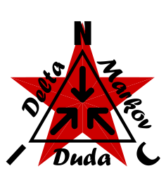

<p align="center">
  
</p>


★ N.I.C. ★

# NIC DMD — Delta Markov Duda

## Библиотека шифрования для встраиваемых устройств

[](https://opensource.org/licenses/MIT)

---

## Что такое DMD?

DMD — это кроссплатформенный протокол сжатия для небольших пакетов данных с метеостанций, счётчиков электроэнергии, GPS-трекеров и других встраиваемых устройств. Он предназначен для передачи по технологиям с ограниченной полосой пропускания, таким как LoRa.

Протокол полностью работает на микроконтроллере ATmega328 и не требует больших словарей или таблиц поиска в памяти. Каждый пакет сжимается независимо — путём адаптивного выбора наилучшего метода из пяти кандидатов.

---

## Почему DMD?

Существующие библиотеки сжатия для встраиваемых устройств либо требуют сотни дополнительных байт RAM (Heatshrink), либо нуждаются в передаче таблицы Хаффмана вместе с данными. DMD идёт другим путём — объединяет несколько простых методов с эвристическим анализом и выбирает наилучший результат для каждого пакета по отдельности.

**Основные преимущества:**
- Фиксированная таблица Хаффмана только в ROM (32 Б), без дополнительной RAM
- Адаптивный выбор метода для каждого пакета — до 5 кандидатов
- Полностью детерминированная декомпрессия — без потери данных
- Максимальное расширение данных на 1 байт (заголовок) в худшем случае
- Реализация на Python и C (ATmega328 / Arduino)

---

## Когда DMD не оправдан

DMD предназначен для данных, которые изменяются медленно и предсказуемо — показания датчиков, GPS-координаты, промышленная телеметрия. Если входные данные случайны, зашифрованы или уже сжаты, DMD добавит лишь 1 байт заголовка и отправит их как RAW. Это корректное поведение — без сжатия с потерями, без деградации.

---

## Совместимость

**Python:** 3.10 или новее (используются аннотации типов `bytes | None`).

**C:** C99 или новее. Протестировано с GCC на PC (Linux/Windows) и AVR-GCC для ATmega328. Нет зависимостей от стандартной библиотеки, кроме `<string.h>`. Внутренние буферы задаются через C99 VLA по фактической длине пакета.

**Arduino:** Скопируйте `nic_dmd.c` и `nic_dmd.h` в папку проекта. Совместимо с Arduino IDE 1.8+ и 2.x (AVR-GCC поддерживает C99 VLA).

**Примечание для других компиляторов:** IAR, Keil и MSVC C++ не поддерживают VLA. Для этих инструментальных цепочек при компиляции можно задать `-DDMD_PKT_MAX_BUILD=N` (например, 32 или 64) — буферы будут фиксированного размера.

**Зависимости для fetch/benchmark:** `pip install requests`

**Длина пакета:** Минимальное техническое ограничение — 1 Б, однако при длине менее 16 Б сжатие практически нецелесообразно: накладные расходы заголовка (1 Б) и состояния ANS (2 Б) поглощают большую часть возможной экономии. Рекомендуемый минимум — **16 Б**. Максимум — **255 Б**. Для передачи по LoRa практический предел полезной нагрузки составляет 51–64 Б в зависимости от коэффициента расширения спектра и региона. Наилучших результатов DMD достигает на данных, где соседние пакеты изменяются медленно — как правило, это 16–64 Б сенсорная телеметрия.

---

## Проверка и целостность данных

В целях достижения максимальной производительности и минимизации нагрузки на процессор библиотека не выполняет дополнительных проверок заголовка и не валидирует длину переданных данных.

Протокол строго предполагает, что проверку целостности (например, аппаратный CRC) и отбрасывание повреждённых или пустых пакетов выполняет нижележащий транспортный уровень или основная программа (как правило, сам радиомодуль, логика сбора данных и т. п.). Пользователь библиотеки обязан на уровне приложения гарантировать, что в функции сжатия и декомпрессии поступают только структурно корректные данные. Такое делегирование ответственности обеспечивает низкие накладные расходы по памяти без напрасного расходования тактов процессора.

---

## Результаты

Протестировано на более чем 50 000 образцах из 20 реальных и синтетических источников данных (метеостанции, GPS, счётчики электроэнергии, промышленные датчики, сейсмология, качество воздуха). Ошибки обратного преобразования: **0 во всех наборах данных**.

Столбец **выход Б/пкт** — это средний фактический размер передаваемого пакета после сжатия (включая 1 Б заголовка). Именно этот показатель важен для расчёта размера окна передачи LoRa.

### Таблица 1 — равномерный int16 (fetch_plus.py)

Все поля хранятся как `int16` с масштабированием ×100, пакеты дополняются нулями до фиксированной длины. Наборы данных Forecast содержат 384 образца (16 дней × 24 часа), остальные — 8 000–10 000 образцов.

```
===================================================================================
  Набор данных               | Пкты  | Вход  | Выход   | Экономия| Осн. метод
------------------------------|-------|-------|---------|---------|------------------
NOAA San Francisco (приливы)  |  8184 |  16 Б |   6.4 Б |  62.2%  | DELTA1+ZZ+FLAG
NOAA New York (приливы)       |  8184 |  16 Б |   6.7 Б |  60.6%  | DELTA1+ZZ+FLAG
DWD Fichtelberg (метео)       | 10000 |  16 Б |   8.1 Б |  52.6%  | DELTA1+ZZ+FLAG 75%
DWD Helgoland (метео)         | 10000 |  16 Б |   8.5 Б |  49.8%  | DELTA1+ZZ+FLAG 74%
DWD Zugspitze (метео)         | 10000 |  16 Б |   8.6 Б |  49.2%  | DELTA1+ZZ+FLAG 73%
GPS Trek                      | 10000 |  16 Б |   8.6 Б |  49.3%  | DELTA1+ZZ+FLAG 53%
Комплексная станция           | 10000 |  64 Б |  38.6 Б |  40.7%  | DELTA1+ZZ+HUF  84%
AirQuality Brno               |   168 |  16 Б |  10.3 Б |  39.7%  | FLAG + D1+ZZ+FLAG
AirQuality Ostrava            |   168 |  16 Б |  10.5 Б |  38.4%  | FLAG + D1+ZZ+FLAG
Счётчики электроэнергии       | 10000 |  16 Б |  10.6 Б |  37.7%  | DELTA1+ZZ+HUF  52%
AirQuality Praha              |   168 |  16 Б |  10.6 Б |  37.6%  | FLAG + D1+ZZ+FLAG
Forecast Praha (32Б)          |   384 |  32 Б |  22.0 Б |  33.2%  | DELTA1+ZZ+FLAG 58%
Forecast Brno (32Б)           |   384 |  32 Б |  22.4 Б |  32.1%  | DELTA1+ZZ+FLAG 55%
IoT здание                    | 10000 |  16 Б |  11.7 Б |  31.3%  | DELTA1+ZZ+HUF  84%
Промышленный датчик           | 10000 | 128 Б |  89.3 Б |  30.7%  | DELTA1+ZZ+HUF  80%
Forecast Ostrava (16Б)        |   384 |  16 Б |  12.3 Б |  27.3%  | DELTA1+ZZ+FLAG 42%
Forecast Praha (16Б)          |   384 |  16 Б |  12.4 Б |  26.8%  | DELTA1+ZZ+FLAG 41%
Forecast Brno (16Б)           |   384 |  16 Б |  12.5 Б |  26.5%  | DELTA1+ZZ+FLAG 43%
Forecast Bratislava (16Б)     |   384 |  16 Б |  12.7 Б |  25.3%  | DELTA1+ZZ+FLAG 38%
USGS сейсмика                 | 10000 |  16 Б |  13.9 Б |  18.2%  | FLAG 29% (хаот.)
===================================================================================
  Диапазон: 18 % – 62 %   |   Ошибки: 0
===================================================================================
```

### Таблица 2 — schema-aware tight packing (fetch_small.py)

Каждое поле хранится в минимально необходимом типе (uint8/int16) с масштабированием ×10, без заполнения нулями.

```
===================================================================================
  Набор данных               | Пкты  | Вход  | Выход   | Экономия| Осн. метод
------------------------------|-------|-------|---------|---------|------------------
Forecast Praha (27Б)          |   384 |  27 Б |  17.1 Б |  39.0%  | DELTA1+ZZ+HUF  63%
Forecast Brno (27Б)           |   384 |  27 Б |  17.2 Б |  38.5%  | DELTA1+ZZ+HUF  61%
AirQuality Brno (12Б)         |   168 |  12 Б |   8.3 Б |  35.9%  | DELTA1+ZZ+HUF  49%
AirQuality Ostrava (12Б)      |   168 |  12 Б |   8.5 Б |  34.8%  | DELTA1+ZZ+HUF  47%
AirQuality Praha (12Б)        |   168 |  12 Б |   8.6 Б |  34.2%  | DELTA1+ZZ+HUF  44%
Forecast Ostrava (13Б)        |   384 |  13 Б |   9.3 Б |  33.6%  | DELTA1+ZZ+HUF  67%
Forecast Brno (13Б)           |   384 |  13 Б |   9.3 Б |  33.3%  | DELTA1+ZZ+HUF  69%
Forecast Praha (13Б)          |   384 |  13 Б |   9.3 Б |  33.3%  | DELTA1+ZZ+HUF  70%
Forecast Bratislava (13Б)     |   384 |  13 Б |   9.4 Б |  32.5%  | DELTA1+ZZ+HUF  72%
DWD Fichtelberg (9Б)          | 10000 |   9 Б |   6.3 Б |  37.0%  | D1+ZZ+ANS  49%
DWD Helgoland (9Б)            | 10000 |   9 Б |   6.4 Б |  36.0%  | D1+ZZ+ANS  42%
DWD Zugspitze (9Б)            | 10000 |   9 Б |   6.4 Б |  35.6%  | D1+ZZ+ANS  42%
USGS сейсмика (8Б)            | 10000 |   8 Б |   8.6 Б |   3.9%  | RAW 79% ⚠ расширение
NOAA New York (3Б)            |  8184 |   3 Б |   4.0 Б |   0.0%  | RAW 100% ⚠ расширение
NOAA San Francisco (3Б)       |  8184 |   3 Б |   4.0 Б |   0.0%  | RAW 100% ⚠ расширение
===================================================================================
  Диапазон: 0 % – 39 %   |   Ошибки: 0
  ⚠ При пакетах < 8 Б выход больше входа — накладные расходы заголовка (1 Б) превышают экономию.
===================================================================================
```

### Таблица 3 — сырой текст JSON/CSV (fetch_raw_text.py)

Данные в точности так, как поступают из источников — без бинарной упаковки, текст как байты, дополненный нулями до длины первой записи.

```
===================================================================================
  Набор данных               | Пкты  | Вход   | Выход   | Экономия| Осн. метод
------------------------------|-------|--------|---------|---------|---------------
DWD Helgoland (raw CSV)       | 10000 |  72 Б  |  21.2 Б |  71.0%  | D1+ZZ+ANS 69%
DWD Zugspitze (raw CSV)       | 10000 |  72 Б  |  21.3 Б |  70.9%  | D1+ZZ+ANS 68%
DWD Fichtelberg (raw CSV)     | 10000 |  72 Б  |  21.4 Б |  70.7%  | D1+ZZ+ANS 67%
NOAA San Francisco (raw JSON) |  8448 |  72 Б  |  26.7 Б |  63.4%  | D1+ZZ+FLAG 38%
NOAA New York (raw JSON)      |  8448 |  72 Б  |  27.3 Б |  62.6%  | D1+ZZ+FLAG 37%
Forecast Bratislava (raw JSON)|   384 | 200 Б  |  73.2 Б |  63.6%  | D1+ZZ+ANS  40%
Forecast Ostrava (raw JSON)   |   384 | 200 Б  |  76.1 Б |  62.2%  | D1+ZZ+ANS  40%
Forecast Praha (raw JSON)     |   384 | 200 Б  |  76.7 Б |  61.9%  | D1+ZZ+ANS  41%
Forecast Brno (raw JSON)      |   384 | 200 Б  |  77.1 Б |  61.6%  | D1+ZZ+ANS  37%
USGS сейсмика (raw CSV)       | 10000 | 216 Б  |  96.5 Б |  55.5%  | D1+ZZ+FLAG 34%
===================================================================================
  Диапазон: 56 % – 71 %   |   Ошибки: 0
===================================================================================
```

---

## Как формат кодирования влияет на сжатие

### Масштабирование ×10 vs ×100 и влияние заполнения нулями

При масштабировании ×100 с равномерной упаковкой int16 (Таблица 1) DMD достигает экономии 49–53 % на данных DWD. При плотной упаковке schema-aware с масштабированием ×10 (Таблица 2) результат составляет лишь 35–37 %. Парадокс: более грубое масштабирование с более крупным пакетом даёт лучшее сжатие. Причина структурна — в 16-байтовом пакете с масштабированием ×100 старший байт каждого int16 после delta+ZigZag обычно близок к нулю, поэтому метод FLAG может представить целый байт одним битом в битовой карте. Плотная упаковка ×10 в uint8/uint16 устраняет эту структуру и переключает сжатие на HUF или ANS.

Данные NOAA — лучший пример влияния намеренных нулевых полей: в варианте 16 Б с 6 нулевыми полями выход составляет **6.4–6.7 Б** (экономия 61–62 %). В варианте 3 Б без заполнения выход равен **4.0 Б** — это хуже входа (3 Б), поскольку обязательный 1-байтовый заголовок перевешивает любую экономию. Намеренное нулевое поле — это не расходование байт впустую, а активная помощь сжатию.

### Абсолютные выходные размеры — что фактически передаётся

Хотя процент экономии у сырого текста выглядит лучшим, с точки зрения фактически передаваемых байт бинарная упаковка явно предпочтительнее:

```
  Данные DWD — сравнение абсолютного выходного размера:
  ┌─────────────────────────────────────────────────────┐
  │ Формат         │ Вход  │ Выход  │ Метод             │
  │─────────────────────────────────────────────────────│
  │ 9Б  schema-aw. │   9 Б │  6.4 Б │ D1+ZZ+ANS         │
  │ 16Б равномерн. │  16 Б │  8.4 Б │ D1+ZZ+FLAG        │
  │ 72Б raw CSV    │  72 Б │ 21.3 Б │ D1+ZZ+ANS         │
  └─────────────────────────────────────────────────────┘

  Данные Forecast — сравнение абсолютного выходного размера:
  ┌─────────────────────────────────────────────────────┐
  │ Формат         │ Вход  │ Выход  │ Метод             │
  │─────────────────────────────────────────────────────│
  │ 13Б schema-aw. │  13 Б │  9.3 Б │ D1+ZZ+HUF         │
  │ 16Б равномерн. │  16 Б │ 12.4 Б │ D1+ZZ+FLAG        │
  │ 27Б schema-aw. │  27 Б │ 17.1 Б │ D1+ZZ+HUF         │
  │ 32Б равномерн. │  32 Б │ 22.2 Б │ D1+ZZ+FLAG        │
  │ 200Б raw JSON  │ 200 Б │ 76.7 Б │ D1+ZZ+ANS         │
  └─────────────────────────────────────────────────────┘
```

Для метеорологических данных DWD равномерный int16 на 16 Б и schema-aware на 9 Б дают сходный итоговый пакет (8.4 Б vs 6.4 Б — разница всего 2 Б), однако вариант 16 Б не требует собственной схемы, легче расширяется новыми переменными и лучше использует заполнение нулями при FLAG-сжатии.

Schema-aware упаковка оправдана исключительно там, где каждый байт имеет значение ещё до сжатия — как правило, при передаче без DMD или на крайне ограниченных каналах.

### Характер данных и доминирующий метод

```
  Медленные изменения + заполнение нулями (NOAA, AQ 16Б) → FLAG
  Медленные метеоизменения (DWD, Forecast)                → DELTA1+ZZ+FLAG
  Синтетические данные без нулей (IoT, промышленность)    → DELTA1+ZZ+HUF
  Сырой текст JSON/CSV                                    → DELTA1+ZZ+ANS
  Случайные данные (USGS малые пакеты)                    → RAW (без экономии)
```

DELTA1 (1-байтовая дельта) доминирует во всех категориях — более 70 % использования по всем наборам данных. DELTA2 и DELTA_FULL применяются редко (до 10 %) только для данных с корреляцией через байтовые границы.

---

## Потребление RAM

Буферы задаются через C99 VLA по фактической длине пакета `N`. Значения включают стек при сжатии и структуры энкодера/декодера.

```
================================================================================
  Длина пакета | Стек сжатия | dmd_encoder_t | dmd_decoder_t | Итого
--------------+-------------+---------------+---------------+---------------
       16Б    |      62Б    |      18Б      |     17Б       |      80Б
       32Б    |      96Б    |      34Б      |     33Б       |     130Б
       64Б    |     164Б    |      66Б      |     65Б       |     230Б
      128Б    |     300Б    |     130Б      |    129Б       |     430Б
      255Б    |     569Б    |     257Б      |    256Б       |     826Б
================================================================================
```

Пиковое потребление RAM при вызове `dmd_compress` = Стек сжатия + dmd_encoder_t.

При типичном использовании с LoRa (пакеты 16–64 Б) пик составляет **80–230 Б** — без проблем на ATmega328 (2 КБ RAM).

---

## Принцип работы

```
+-------------------------------------------------------------------------------+
|                       НАЧАЛО: Входной пакет данных                            |
+-------------------------------------------------------------------------------+
                                    |
                                    v
+-------------------------------------------------------------------------------+
|  Шаг 1: Дельта + ZigZag (для кейфрейма пропускается)                         |
|  Проверить DELTA_1B / DELTA_2B / DELTA_FULL — выбрать минимум единичных битов |
+-------------------------------------------------------------------------------+
                                    |
                                    v
+-------------------------------------------------------------------------------+
|  Шаг 2: Проверить кандидатов на сжатие (каждый с лимитом раннего выхода)     |
|                                                                               |
|   (a) µANS     — только если zero_ratio >= 45%                                |
|   (b) Huffman  — nibble Huffman с фиксированной таблицей в ROM, всегда        |
|   (c) FLAG     — битовая карта нулевых байт, всегда                           |
|   (d) FLAG+HUF — FLAG удаляет нули, Huffman при необходимости жмёт остаток    |
+-------------------------------------------------------------------------------+
                                    |
                                    v
+-------------------------------------------------------------------------------+
|  Шаг 3: Выбрать наименьший результат                                          |
|  Если ничего не помогает → RAW-резерв (delta_type = NONE, исходные данные)   |
+-------------------------------------------------------------------------------+
                                    |
                                    v
+-------------------------------------------------------------------------------+
|  Шаг 4: Собрать заголовок (1Б) + полезная нагрузка → отправить               |
+-------------------------------------------------------------------------------+
```

### Заголовок (1 байт)

Каждый сжатый пакет начинается с одного байта заголовка:

```
MSB                    LSB
 7    6    5    4    3    2    1    0
[huf][ans][flg][dlt][dlt][sn ][sn ][sn ]
```

```
=======================================================================
| Биты |        Значение                                              |
|------|--------------------------------------------------------------|
|   7  | nibble Huffman сжатие        1 = ON                          |
|   6  | µANS сжатие                  1 = ON                          |
|   5  | флагирование нулевых байт    1 = ON                          |
|  4-3 | тип дельты: 00=нет, 01=1Б, 10=2Б, 11=FULL (big-int+carry)  |
|  2-0 | номер образца (0–7)          0 = кейфрейм / стартовый кадр  |
=======================================================================

Комбинация бит 7 + бит 5 = FLAG+HUF (карта нулей + Huffman на ненулевых)
```

Если ни один метод не может сжать данные лучше RAW, исходные данные отправляются с битами 3–7 заголовка, установленными в 0. Получатель распознаёт RAW, поскольку заголовок не использует никаких флагов.

### Уровни сжатия

**1. Дельта — разностный метод**

Сравнение двух последовательных пакетов. Там, где данные изменяются медленно (температура, давление, GPS-координаты), после вычитания образуются цепочки нулевых или очень малых значений. Протокол проверяет три типа дельты и выбирает наилучший результат по эвристике (количество единичных битов).

Поддерживаемые типы:
- **1Б дельта** — побайтово (арифметика uint8_t)
- **2Б дельта** — по 16-битным словам big-endian (арифметика uint16_t)
- **FULL дельта** — весь пакет как одно большое число с распространением переноса по всем байтам. Выигрывает на счётчиках и GPS-координатах, где значение переполняется через байтовые границы.

**2. ZigZag-кодирование**

После применения дельты данные преобразуются ZigZag-кодированием. Отрицательные разности отображаются в малые нечётные числа, положительные — в малые чётные. Результатом являются данные с высокой долей нулевых битов, которые лучше реагируют на последующие методы сжатия.

ZigZag не применяется, если дельта = нет (включая кейфрейм). Дельта и ZigZag выполняются за один проход по данным.

**3. Флагирование нулевых байт (FLAG)**

Каждый нулевой байт заменяется одним битом в битовой карте. Перед картой хранится длина пакета (1 Б). Ненулевые байты следуют в исходном порядке.

Пример для пакета 16 Б с 12 нулями:
```
Исходные: [0, 0, 5, 0, 0, 0, 3, 0, 0, 0, 0, 0, 7, 0, 0, 2]  (16Б)
Нагрузка: [16][11011101 11110110][5, 3, 7, 2]
           1Б длина + 2Б карта + 4Б ненулевые = 7Б
Результат: 8Б вместо 16Б (1Б заголовок + 7Б нагрузка)
```

**4. µANS сжатие**

Асимметричные системы счисления (ANS) работают на уровне битов с двумя весами: нулевой бит высоковероятен (29/32), единичный — менее вероятен (3/32). Для данных с преобладанием нулей после delta+ZigZag достигает значительного сжатия без таблицы.

Нагрузка ANS содержит длину данных (1 Б), состояние (2 Б — uint16_t) и закодированные байты. Запускается только если доля нулевых байт >= 45 % (эвристика). Энкодер и декодер имеют ранний выход — если результат превысит лимит, вычисление немедленно прекращается.

**5. Nibble Huffman (HUF)**

Фиксированная таблица Хаффмана, обученная на объединённых метео- и GPS-данных после delta+ZigZag. Кодирует каждый байт двумя nibble-кодами (hi и lo). Таблица хранится в ROM (32 Б PROGMEM на ATmega), без дополнительной RAM.

Максимальная длина кода — 6 битов, среднее ~3.2 бита на байт. Выигрывает прежде всего на IoT-, промышленных и сложных данных, где нули редки, но распределение nibble соответствует таблице.

**6. Комбинация FLAG+HUF**

FLAG сначала удаляет нулевые байты в битовую карту, затем Huffman сжимает оставшиеся ненулевые байты. Нагрузка: `[1Б длина][карта][1Б valid bits HUF][HUF stream]`. Лучшее из двух миров — детерминированное устранение нулей + энтропийное сжатие остатка.

**Кейфрейм и стартовый кадр**

Образец с номером 0 является кейфреймом. Поскольку предыдущего пакета для вычисления дельты нет, разностный метод и ZigZag пропускаются. Данные обрабатываются напрямую методами FLAG, HUF, FLAG+HUF или ANS. Кейфрейм возникает автоматически каждые 8 пакетов или после сброса устройства.

---

## Использование

### Python

```python
from nic_dmd import DmdEncoder, DmdDecoder

PKT_LEN = 16
enc = DmdEncoder(PKT_LEN)
dec = DmdDecoder(PKT_LEN)

data = bytes([0xFC, 0x18, 0x21, 0x34, 0x01, 0x81,
              0x04, 0xCE, 0x00, 0x00, 0xFC, 0x7C,
              0xFC, 0xA8, 0x00, 0x00])

compressed   = enc.compress(data)
decompressed = dec.decompress(compressed)

print(f"Сжато: {PKT_LEN}Б → {len(compressed)}Б")
assert decompressed == data
```

### C (ATmega328 / Arduino)

```c
#include "nic_dmd.h"

dmd_encoder_t enc;
dmd_decoder_t dec;

void setup() {
    dmd_encoder_init(&enc, 16);   // длина пакета — должна совпадать на обеих сторонах
    dmd_decoder_init(&dec, 16);
}

void loop() {
    uint8_t data[16]          = { /* данные датчика */ };
    uint8_t compressed[DMD_OUT_MAX];
    uint8_t decompressed[16];

    uint8_t comp_len = dmd_compress(&enc, data, compressed);
    lora.send(compressed, comp_len);

    // На приёмнике:
    dmd_decompress(&dec, compressed, comp_len, decompressed);
}
```

### Сборка без поддержки VLA

Если ваш компилятор не поддерживает C99 VLA (IAR, Keil, MSVC C++), задайте максимальную длину пакета при компиляции:

```
gcc -DDMD_PKT_MAX_BUILD=32 nic_dmd.c ...
```

Буферы будут скомпилированы с фиксированным размером 32 Б. Для проектов с одной фиксированной длиной пакета (типичный сценарий Arduino) этот вариант идеален.

---

## Файлы

| Файл                 | Описание                                                 |
| -------------------- | -------------------------------------------------------- |
| `nic_dmd.py`         | Реализация на Python — эталонная, для тестирования       |
| `nic_dmd_utils.py`   | Вспомогательные функции — анализ и вывод результатов     |
| `nic_dmd.c`          | Реализация на C для ATmega328                            |
| `nic_dmd.h`          | Заголовочный файл                                        |
| `Makefile`           | Сборка и тестирование                                    |

### Тестирование и бенчмарк

| Файл                  | Описание                                                           |
| --------------------- | ------------------------------------------------------------------ |
| `nic_dmd_test.py`     | Тесты Python — round-trip, метео, кейфрейм                         |
| `nic_dmd_test.c`      | Тесты C — round-trip, all-zeros, метео                             |
| `fetch_plus.py`       | Бенчмарк — реальные + синтетические данные, равномерный int16      |
| `fetch_small.py`      | Бенчмарк — те же источники, schema-aware tight packing             |
| `fetch_raw_text.py`   | Бенчмарк — сырой текст JSON/CSV как байты                          |
| `benchmark.py`        | Сравнение DMD vs Huffman vs Heatshrink                             |

---

## Лицензия

MIT License — Copyright (c) 2026 NIC — Native Intellect Community

---

## Благодарности

Брату за советы при разработке этого проекта.
За техническую помощь в оптимизации кода — ИИ-ассистентам Claude (Anthropic) и Gemini (Google).

★ Viva La Resistánce ★
